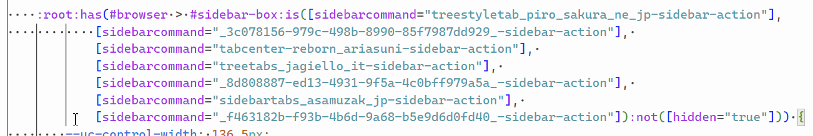
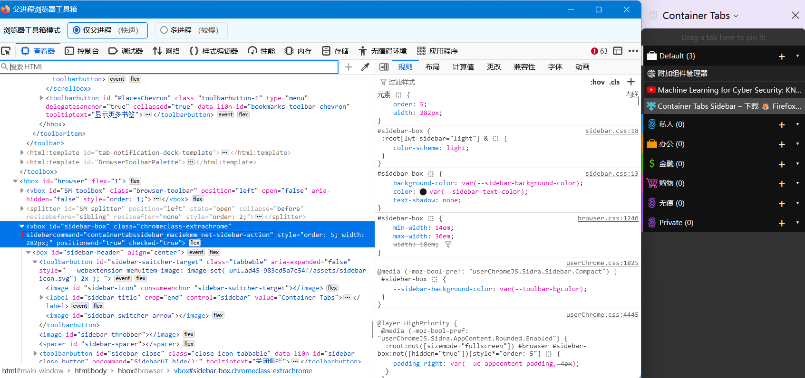

# 用户样式

这里的样式都是 Firefox 界面修改样式，可以直接复制到到 userChrome.css 里使用。

如果你有使用 UC 脚本，建议使用 [UserCSSLoader.uc.js]() 来载入，方便调试。

## 样式额外说明

### hide_tabstoolbar_when_tst_shown_fx122.css

显示垂直标签栏的时候隐藏横向标签栏。

需要按需修改控制按钮的宽高。

如果没有适配你的垂直标签扩展，按需增加选择器即可。

比如要兼容`Container Tabs Sidebar`，先装上扩展，通过浏览器内容工具箱获取 sidebarCommand

### material_fox_updated_fix.ag.css

这是修复 [material_fox_updated](github.com/edelvarden/material-fox-updated)主题的 CSS，仅适用于 [e3kskoy7wqk/Firefox-for-windows-7](https://github.com/e3kskoy7wqk/Firefox-for-windows-7)