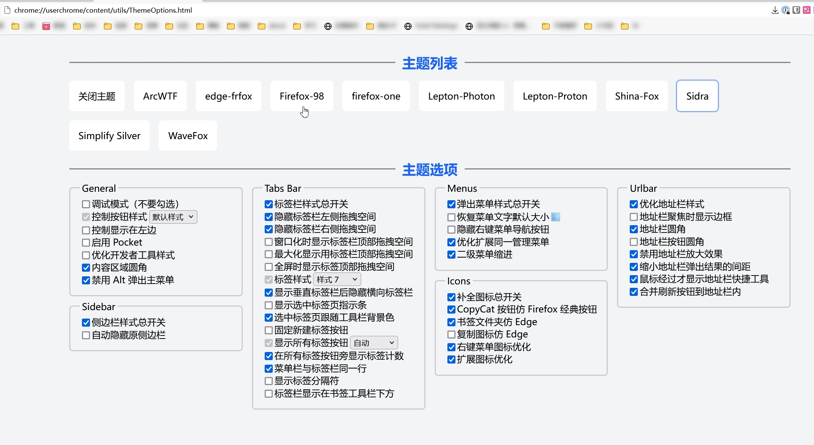

# 自定义 CSS 主题

Ver 代表最后测试版本

| Ver  | File            | Description                                                  |
| ---- | --------------- | ------------------------------------------------------------ |
| 90   | oneline.css     | 单行主题                                                     |
| 137  | Sidra           | benzbrake 主用的 CSS 主题                                    |
| 90   | IE8(deprecated) | 仿IE8主题，来自 matthewmx86/Redmond-Firefox，简单修复        |
| 125  | Simple Silver   | 来自 [CristianDragos/FirefoxThemes](https://github.com/CristianDragos/FirefoxThemes/) |

## 使用

### 方法1

`about:config` → `toolkit.legacyUserProfileCustomizations.stylesheets`→ `true`

单独的 css 复制内容到**配置文件夹**下的`userChrome.css`文件中

单独目录的 CSS 文件下载文件夹内容存放到**配置文件夹**下

### 方法2

这里的主题如果支持主题选项，需要使用[CopyCatTheme.uc.js](https://github.com/benzBrake/FirefoxCustomize/blob/master/userChromeJS/CopyCatTheme.uc.js)读取。

选项示例：

## IE8 主题预览

