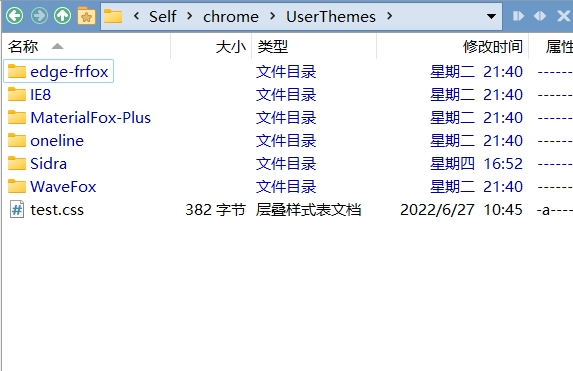
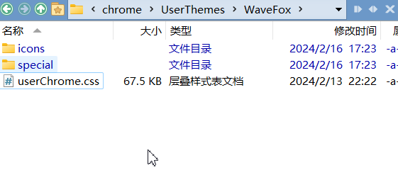
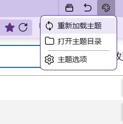
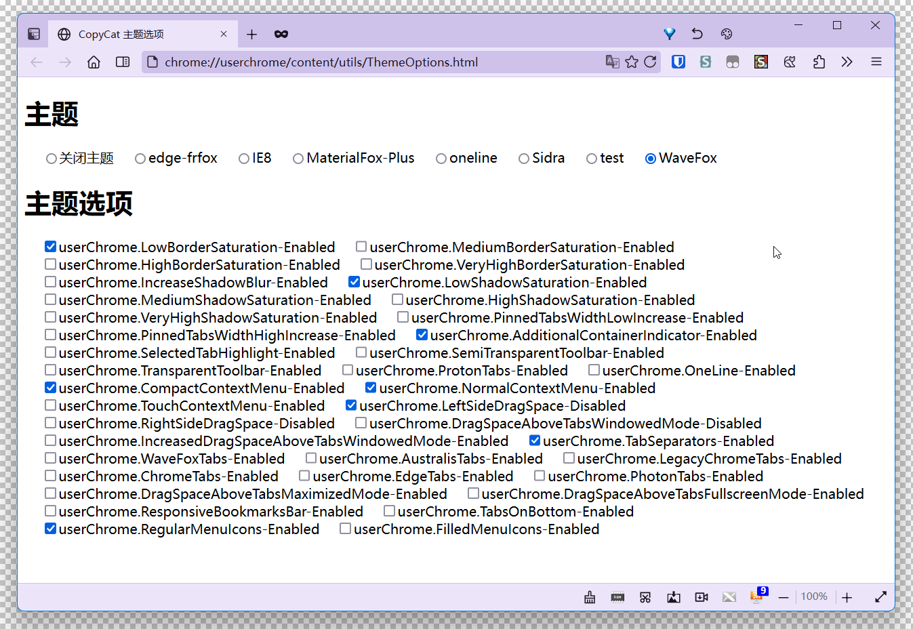
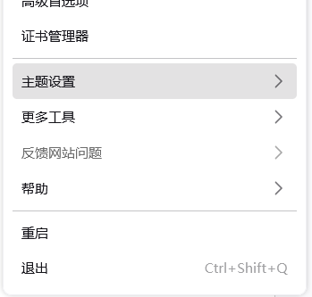
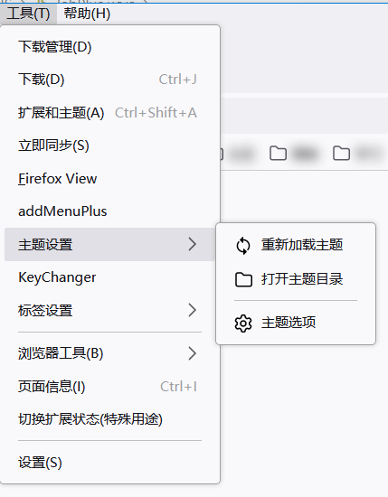
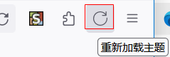

# CopyCatTheme

这个脚本主要用来快速切换 CSS 主题，会自动读取对应主题的 userChrome.css 中 pref 变量显示成主题选项菜单，~~目前不支持 userContent.css~~。

### 安装说明

建议使用我组装的 userChrome.js 环境（[https://github.com/benzBrake/FirefoxCustomize/tree/master/userChromeJS/Loader](https://github.com/benzBrake/FirefoxCustomize/tree/master/userChromeJS/Loader)），不然可能无法使用主题选项。

把`CopyCatTheme.zip`解压到`chrome`目录下即可

### 使用方法

把主题存放在 chrome 文件夹里的 UserThemes 目录下，一个主题一个文件夹

比如 WaveFox 主题，来自于 [https://github.com/QNetITQ/WaveFox](https://github.com/QNetITQ/WaveFox)，下载把吧 userChrome.css 以及附带的文件放入 chrome/UserStyles/WaveFox 下

然后热重载就可以在主题列表看到 WaveFox 了。

### 其他问题

1.如果想把菜单移动到三道杠菜单(AppMenu)

在`about:config`里修改参数

``userChromeJS.CopyCat.buildPanel` →`true`

2.如果你想把菜单移动到工具菜单里，在`about:config`里修改参数

`userChromeJS.CopyCat.buildPanel`→`false`

``userChromeJS.CopyCat.showInToolsMenu` →`true`

3.如何增加一个快速重新载入主题的按钮

`userChromeJS.CopyCat.debug`→`true`

