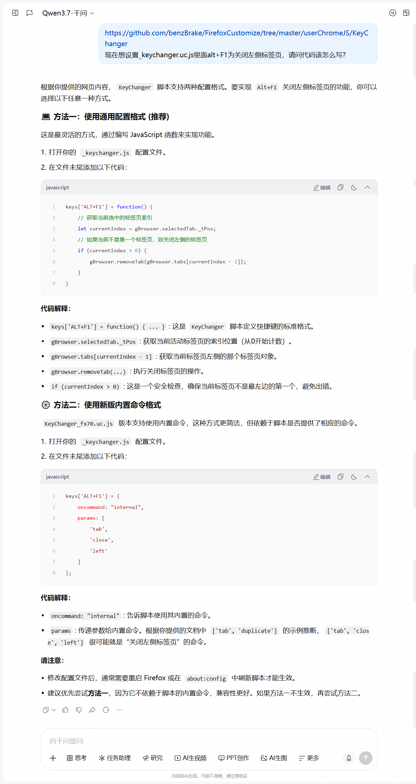

# KeyChanger

A powerful custom keyboard shortcut script for Firefox.

## AI-Powered Configuration

No coding skills needed! Simply describe your needs to an AI, and it will generate the corresponding configuration code for you.

### How to Use

1. **Open any AI chat tool** (e.g., ChatGPT, Claude, Kimi, Qwen, etc.)
2. **Send the script's source code URL ([https://github.com/benzBrake/FirefoxCustomize/tree/master/userChromeJS/KeyChanger](https://github.com/benzBrake/FirefoxCustomize/tree/master/userChromeJS/KeyChanger)) and the contents of `_keychanger.js` to the AI**, so it can understand the current configuration
3. **Describe your desired shortcuts in natural language**, for example:
   - "I want to press F4 to duplicate the current tab"
   - "I want to press Ctrl+Shift+A to close all tabs to the right"
   - "I want to press Alt+T to open a new tab and go to Google"
4. **The AI will generate the corresponding configuration code** — just copy and paste it into `_keychanger.js`
5. **Reload the configuration**

### Demo Screenshot

Below is a real AI conversation screenshot demonstrating how to generate shortcut configurations through natural language:



> **Tip:** If the generated shortcut conflicts with an existing one, the AI will remind you to choose a different key combination.

The default configuration file is `profiledir\chrome\_keychanger.js`, and you can specify the configuration file path by modifying `keyChanger.FILE_PATH`.

## Download and Installation

[Click here](https://chat.openai.com/KeyChanger.uc.js) to download the script and save it in `profiledir\chrome` folder. Then, [click here](https://chat.openai.com/_keychanger.js) to download the example configuration file.

`KeyChanger_fx70.uc.js` is the JSActor version, which will be used for future implementation of visual configuration (currently not implemented due to lack of time).

## Configuration Format

### General Configuration Format

```js
keys['CTRL+ALT+P'] = function() {
	// Your function
}
```

`CTRL+ALT+P` represents the key combination you want to use, and you should fill in your function code at the `// Your function` section.

### New Configuration Format

In `KeyChanger_fx70.uc.js`, in addition to the original configuration format, you can also use the built-in command format.

```json
keys['F4'] = {
    oncommand: "internal",
    params: [
        'tab',
        'duplicate'
    ]
}; // Duplicate the current tab
```

Currently, the built-in commands are continuously being updated, and they will be documented here in the future.

### Example Configuration

[_keychanger.js](https://chat.openai.com/_keychanger.js) translates the configuration into English for me.