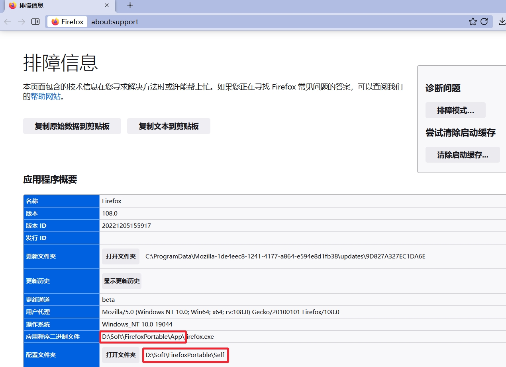
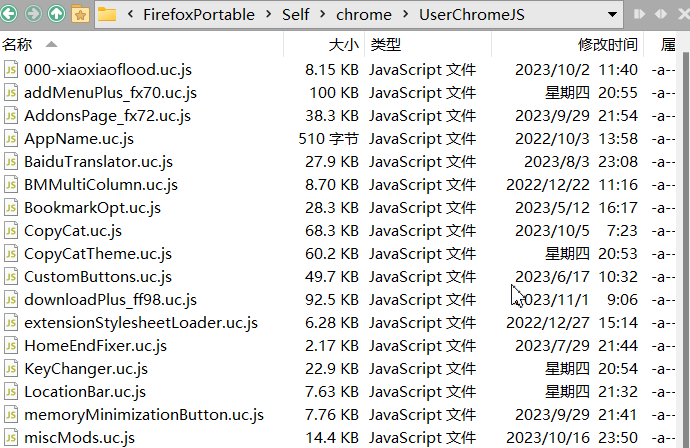

# userChrome.js 环境

## Firefox 92+

基于 alice0775 环境打包，加入了来自 xiaoxiaoflood 环境的 Bootstrap Loader，支持 onlyonce 属性，使用这个 userChrome.js 可以安装适配过的传统扩展，部分 xiaoxiaoflood 的脚本也可以无需移植就能使用。

下载 [fx100.zip](fx100.zip)

实际上可以向下兼容，具体版本没有测试。

### Firefox 57+

下载 [fx57.zip](fx57.zip)

## 使用说明

解压后最多有两个目录，`program`目录里的东西要解压到 Firefox.exe 所在目录，`profile`目录里的文件要解压到配置文件夹。

#### 如何查找 Firefox.exe 所在目录 和 配置文件夹？看图

#### 安装 userChrome.js 环境后如何安装脚本？

下载 `.uc.js` 后缀的文件保存到**配置文件夹**下的**chrome**文件夹下

## 兼容的传统扩展

https://github.com/xiaoxiaoflood/firefox-scripts/tree/master/extensions

