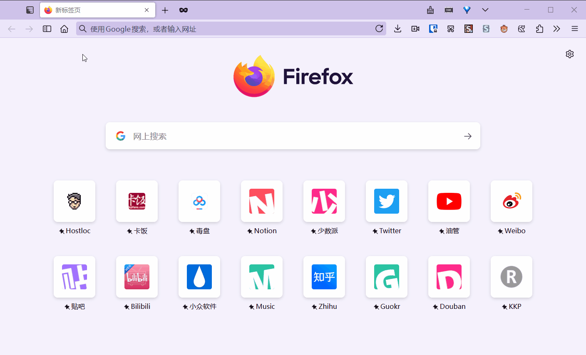

# userChromeJS

收集并涂改大佬的userChromeJS脚本。

## Want to support this project?

**[[ Paypal Me \]](https://www.paypal.me/brakepay)** [ **[Buy me a coffee](https://www.buymeacoffee.com/buyryanacoffie)** ]

## 说明

~~自从2020年11月开始就基于 xiaoxiaoflood 的 [userChromeJS](https://github.com/xiaoxiaoflood/firefox-scripts/) 来修改脚本。~~

自从 2022年12月1日开始基于 [alice0775](https://github.com/alice0775/userChrome.js) 的 UC 环境来修脚本。

Since December 1, 2022, I have been modifying scripts based on [alice0775's](https://github.com/alice0775/userChrome.js) userChrome.js Loader.

你可以安装我打包好的 [UC 环境](Loader)，从2024年5月7日起，我这里打包的 UC环境有限度的兼容[@xiaoxiaoflood/firefox-scripts](https://github.com/xiaoxiaoflood/firefox-scripts)和[@aminomancer/uc.css.js](https://github.com/aminomancer/uc.css.js)这两个仓库的脚本，并且也能安装适配过的传统扩展。

You can install my packaged [userChrome.js Loader](Loader). Starting from May 7, 2024, the userChrome.js Loader here has limited compatibility with scripts from [@xiaoxiaoflood/firefox-scripts](https://github.com/xiaoxiaoflood/firefox-scripts) and [@aminomancer/uc.css.js](https://github.com/aminomancer/uc.css.js) repositories, and can also install adapted legacy extensions.

我的当前 Firefox 版本 Firefox 125.0.3。

My current Firefox version is Firefox 125.0.3.

最低支持 Firefox 101 的脚本就会放 101 目录里，不过版本可能不太准确。

Scripts that support Firefox 101 at minimum will be placed in the 101 directory, although the version may not be accurate.

### 标志

⛔ 为不可用状态

🅰️ 仅可以在 [alice0775](https://github.com/alice0775/userChrome.js) 的 userChromeJS 环境中使用。Can only be used in [alice0775's](https://github.com/alice0775/userChrome.js) userChrome.js Loader.

❌ 仅可以在 [xiaoxiaoflood](https://github.com/xiaoxiaoflood/firefox-scripts/) 的 userChromeJS 环境中使用。Can only be used in [xiaoxiaoflood's](https://github.com/xiaoxiaoflood/firefox-scripts/) userChrome.js Loader.

Ⓜ️ 仅可以在 [MrOtherGuy](https://github.com/MrOtherGuy/fx-autoconfig) 的 userChromeJS 环境中使用。Can only be used in [MrOtherGuy](https://github.com/MrOtherGuy/fx-autoconfig)'s userChromeJS environment.

### 脚本列表

PS：源链接不代表真正出处，只是说明原版从哪下载的，没有的就是我写的或者忘记了。

P.S.: The source links do not necessarily represent the true origin, they simply indicate where the original version was downloaded from. If no source is provided, it means that either I wrote it or forgot its origin.

V：代表收集、修改时或者测试时的我所使用的最低Firefox版本，并不代表脚本的最低兼容脚本(兼容更低版本的脚本在版本号文件夹里)

V: Represents the minimum Firefox version I used when collecting, modifying, or testing, and does not necessarily represent the minimum compatible version of the script. Scripts compatible with lower versions are placed in version-specific folders.

| ℹ️    | V    | 脚本                                                         | 说明                                                         | 源                                                           |
| ---- | ---- | ------------------------------------------------------------ | ------------------------------------------------------------ | ------------------------------------------------------------ |
|      | 57   | [addMenuPlus](addMenuPlus)                                   | 自定义火狐菜单，也支持工具按钮移动                           | [📃](https://github.com/ywzhaiqi/userChromeJS/tree/master/addmenuPlus) |
|      | 72   | [AddonsPage](AddonsPage_fx72.uc.js)                          | 附加组件页面管理 userChromeJS 脚本<br />~~xiaoxiaoflod 的 userChromeJS 环境仅可展示，不可管理~~**已经解决**<br />仅在 Firefox 100 中测试过 | [📃](https://u6.getuploader.com/script/download/2051)         |
|      | 90   | [AutoHideTabsToolbar](AutoHideTabsToolbar.uc.js)             | 只有一个标签时隐藏标签栏                                     | [📃](https://forum.mozilla-russia.org/viewtopic.php?id=76642) |
|      | 100  | [AutoPopup](AutoPopup.uc.js)                                 | 自动弹出菜单，好像是从阳光盒子定制版里拉出来的               |                                                              |
|      |      | [autoPopup++](autoPopup++.uc.js)                             | 自动弹出菜单增强版                                           | [📃](https://bbs.kafan.cn/thread-1866855-1-1.html)            |
|      |      |                                                              |                                                              |                                                              |
|      | 108  | [BMMultiColumn](BMMultiColumn.uc.js)                         | 多列书签，修复与我的`BookmarkOpt.uc.js`共同使用会报错        | [📃](https://bbs.kafan.cn/thread-2114879-1-1.html)            |
|      | 57   | [BookmarkOpt](BookmarkOpt.uc.js)                             | 书签操作增强，添加”添加书签到此处“和“更新书签为当前网址“<br />融合了`AddBMHere.uc.js`、`AddBookmarkHere.uc.js`、`UpdateBookmarkLite.uc.js`侧边栏添加“复制标题”和“复制链接”<br />增加了一个【显示/隐藏书签工具栏】的按钮<br />低版本Firefox有的功能不能用，建议升级 Firefox |                                                              |
|      | 100  | [browsertoolbox](browsertoolbox.uc.js)                       | 新增一个打开“浏览器内容工具箱”的按钮                         | [📃](https://github.com/Endor8/userChrome.js/blob/master/Firefox-96/browsertoolbox.uc.js) |
|      | 90   | [ColorfulTabs](ColorfulTabs.uc.js)                           | 多彩标签页                                                   |                                                              |
|      | 100  | [CopyCat](CopyCat.uc.js)                                     | 给 Firefox 增加一个按钮，类似于 AnoBtn                       |                                                              |
|      | 100  | [CopyCatTheme](CopyCatTheme/CopyCatTheme.uc.js)              | 读取 Firefox CSS 主题                                        |                                                              |
|      | 57   | [CopyPlainText](CopyPlainText.uc.js)                         | 右键菜单复制和Ctrl+C强制复制纯文本                           |                                                              |
|      | 108  | [CustomButtons](CustomButtons.uc.js)                         | 替代 [Firefox_ToolBarButtons](70/Firefox_ToolBarButtons.uc.js) |                                                              |
|      |      | [dav_LinkifiesLocationBar](dav_LinkifiesLocationBar.uc.js)   | 多级地址栏，源自 *locationbar2* 扩展                         | [📃](https://github.com/sdavidg/firefoxChromeScripts)         |
|      | 72   | [downloadPlus_ff98](downloadPlus/downloadPlus_ff98.uc.js)    | 下载功能增强，保存并打开，第三方工具，另存为<br />复制下载连接，永久删除文件，下载完成播放通知，我主要用另存为和保存并打开，别的功能真的很少用，有问题也别找我，不会修 |                                                              |
|      | 96   | [ExtensionsOptionsMenu](ExtensionsOptionsMenu)               | 汉化版拓展管理器，两个版本，建议使用通用版                   |                                                              |
|      | 100  | [extensionStylesheetLoader](extensionStylesheetLoader.uc.js) | CSS 无需定义 url 即可应用到 WebExtensions 扩展，原版仅能在MrOtherGuy 的 UC 环境使用 | [📃](https://github.com/aminomancer/uc.css.js/blob/master/JS/extensionStylesheetLoader.uc.js) |
|      | 57   | [HomeEndFixer](HomeEndFixer.uc.js)                           | 让 Home / End 按键全局生效（部分全局鼠标手势软胶通过模拟点击 Home / End 实现回到顶部，前往底部，但是默认情况下焦点在输入框内 Home/ End 按键不生效会导致鼠标手势失效，而这个脚本可以让这两个按键全局生效） |                                                              |
|      | 70   | [KeyChanger](KeyChanger/KeyChanger.uc.js)                    | 自定义按键，配置参考 [_keychanger.js](KeyChanger/_keychanger.js) | [📃](https://github.com/Griever/userChromeJS/blob/master/KeyChanger/KeyChanger.uc.js) |
|      | 90   | [LinkGopher](LinkGopher.uc.js)                               | 提取链接，代替 LinkGopher 扩展                               |                                                              |
|      | 107  | [LocationBar](LocationBar.uc.js)                             | 地址栏内新增一个工具栏                                       |                                                              |
|      | 100  | [MenubarReplaceWithButton](MenubarReplaceWithButton.uc.js)   | 把主菜单替换成按钮                                           | [📃](https://u6.getuploader.com/script/download/2051)         |
|      | 90   | [middleClickTabContextMenu](middleClickTabContextMenu.uc.js) | 使用鼠标中键打开标签页菜单（配合右键关闭标签页使用）         | [📃](https://kkp.disk.st/firefox-uses-the-middle-click-to-open-the-tab-context-menu.html) |
|      | 90   | [miscMods](miscMods.uc.js)                                   | 没有分类的脚本合集，粘贴并转到增加 Access Key，中键单击地址栏复制当前地址，右键地址栏收藏按钮打开书签管理，右键刷新按钮强制刷新，右键 xiaoxiaoflood 的扩展管理管理器打开扩展管理页面，右键 Styloaix 按钮打开主题管理，中键下载按钮提示保存 URL，右键下载按钮打开下载历史，右键下载按钮打开下载管理，左键侧边栏按钮打开书签侧边栏，中键侧边栏按钮切换侧边栏方向，右键侧边栏按钮打开历史侧边栏，CTRL + F 开关侧边栏，只有一个标签时退出浏览器页提示（需要打开关闭浏览器时提示的功能） |                                                              |
|      | 100  | [movableOverflowButton](movableOverflowButton.uc.js)         | 可移动 更多工具 按钮                                         |                                                              |
|      | 100  | [movablePanelUIButton](movablePanelUIButton.uc.js)           | 可移动 PanelUI 按钮，改成可热插拔了                          | [📃](https://bbs.kafan.cn/thread-2231475-1-1.html)            |
|      | 100  | [OpenWithHelper](OpenWithHelper)                             | 使用其他应用打开当前地址，支持自定义                         |                                                              |
| 🅰️    |      | [privateTab](privateTab)                                     | 无痕标签，一共两个版本                                       |                                                              |
|      | 100  | [PipMod](PipMod.uc.js)                                       | 视频小窗进度条修改                                           |                                                              |
| ❌    | 96   | [rebuild_userChrome](rebuild_userChrome.uc.js)               | 汉化版脚本管理器                                             | [📃]()                                                        |
|      | 98   | [restoreOldStyleCleanHistory](restoreOldStyleCleanHistory.uc.js) | 还原清除历史记录为旧版对话框                                 |                                                              |
|      | 98   | [restoreOldStyleLaunchApp](restoreOldStyleLaunchApplication.uc.js) | 还原调用第三方软件为旧版对话框                               | [📃](https://bbs.kafan.cn/thread-2231355-1-1.html)            |
|      | 72   | [SaveAsPNG](SaveAsPNG.uc.js)                                 | 保存图片为 PNG格式                                           |                                                              |
|      | 68   | [saveUCJS](saveUCJS.uc.js)                                   | 快速保存 github 上的 UC 脚本                                 |                                                              |
|      | 96   | [setViewSourceEditor](setViewSourceEditor.uc.js)             | 打开Firefox自动设置编辑器路径（用于便携版FF）                |                                                              |
|      | 100  | [showLimitedTimeTheme](showLimitedTimeTheme.uc.js)           | 主题中心显示过期的限时主题                                   | [📃](https://bbs.kafan.cn/thread-2234549-1-1.html)            |
|      | 78   | [sidebarAttrubesDetector](sidebarAttrubesDetector.uc.js)     | 浏览器主窗口增加`sidebarHidden`和`sidebarCommand`属性        |                                                              |
|      | 117  | [SidebarModoki](SidebarModoki.uc.js)                         | 侧边工具栏修改版                                             | [📃](https://github.com/alice0775/userChrome.js/blob/master/106/SidebarModoki.uc.js) |
|      | 107  | [StatusBar](StatusBar.uc.js)                                 | 状态栏脚本，应该通用吧                                       | [📃](https://github.com/Floorp-Projects/Floorp/blob/242338213f92dcdc79e677842526d7ca098d9218/floorp/browser/base/content/browser-statusbar.js) |
|      | 90   | [syncTabsMod](syncTabsMod.uc.js)                             | 受同步的标签页按钮/侧边栏增强                                | [📃](https://blog.iplayloli.com/synctabsbtnmoducjs-firefox-enhanced-with-synchronized-tab-buttons.html) |
|      | 90   | [tabNotifitionBadge.uc.js](tabNotifitionBadge.uc.js)         | 仿 Vivaldi 的功能  标签页图标显示未读消息数量                |                                                              |
|      | 100  | [textZoomPerDomain](textZoomPerDomain_e10s.uc.js)            | 分域名设定字体大小                                           | [📃](https://github.com/alice0775/userChrome.js/blob/master/100/textZoomPerDomain_e10s.uc.js) |
|      | 90   | [textZoomTool](textZoomTool.uc.js)                           | 文本缩放                                                     |                                                              |
|      | 78   | [toggleExtensions](toggleExtensions.uc.js)                   | 工具菜单添加一键切换扩展状态，用于修复便携版扩展图标问题     |                                                              |
|      | 100  | [ToolbarAutoHide](ToolbarAutoHide.uc.js)                     | 自动隐藏 标签栏/工具栏/书签栏                                | [📃](https://u6.getuploader.com/script/download/2061)         |
|      | 78   | [ucf_drag_ModR](ucf_drag_ModR.uc.js)                         | 鼠标拖拽 Drag & Go，来自于 Mozilla-Russia 论坛，Ryan 修改自用 | [📃](https://forum.mozilla-russia.org/viewtopic.php?pid=797234#p797234) |
|      | 78   | [uiDensity](uiDensity.uc.js)                                 | 非浏览器主窗口增加uidensity属性                              |                                                              |
|      | 100  | [UndoCloseTabButtonN](UndoCloseTabButtonN.uc.js)             | 查看已关闭的标签页和窗口                                     | [📃](https://u6.getuploader.com/script/download/2043)         |
|      | 115  | [unifiedExtensionsEnhance](unifiedExtensionsEnhance.uc.js)   | 扩展管理按钮增强，左键点击切换状态，点击设置按钮打开设置页面 |                                                              |
|      | 100  | [unreadTabMods](unreadTabMods.uc.js)                         | 未读标签页修改                                               | [📃](https://github.com/aminomancer/uc.css.js/blob/master/JS/unreadTabMods.uc.js) |
|      | 80   | [UserCSSLoader](UserCSSLoader/UserCSSLoader.uc.js)           | UserCSSLoader 修改版，结合了部分 Styloaix 的特性，支持编辑保存后自动刷新 | [📃](https://github.com/Griever/userChromeJS)                 |
|      | 70   | [verticalAddOnBar](verticalAddOnBar.uc.js)                   | 增加一个类似 vivaldi 的侧边工具栏                            |                                                              |
|      | 100  | [verticalTabsPane](verticalTabsPane.uc.js)                   | 垂直标签栏，原版只能在 MrOtherGuy 的 UC 环境使用，修改版应该通用了，并且把默认快捷键修改为 Ctrl+F1 了 | [📃](https://github.com/aminomancer/uc.css.js/blob/master/JS/verticalTabsPane.uc.js) |

下面的不能用了的话，请一定不要找我，因为我不用了，你们可以顺着源链接过去找原作者修复

|  ℹ️   | V    | 脚本                                                         | 说明                                                         |                              源                              |
| :--: | ---- | ------------------------------------------------------------ | ------------------------------------------------------------ | :----------------------------------------------------------: |
|      | 68   | [AddBookmarkHere](68/AddBookmarkHere.uc.js)                  | 添加 "添加书签到此处" 到书签栏右键菜单（仅在 Firefox 100 中测试过），如果想使用 WebExtension 版[看这里](https://github.com/benzBrake/FirefoxCustomize/tree/master/extensions/addbookmarkhere)，已经被 BookmarkOpt.uc.js 替代 |                                                              |
|      | 90   | [addToolbarInsideLocationBar](addToolbarInsideLocationBar.uc.js) | 添加一个地址内工具栏                                         | [📃](https://github.com/alice0775/userChrome.js/blob/master/zzz-addToolbarInsideLocationBar.uc.js) |
|      | 57   | [AutoCopySelectionText](AutoCopySelectionText.uc.js)         | 自动复制选中文本（ScrLk 亮起时不复制）                       |                                                              |
|      | 95   | [bookmarksmenu_scrollbar](bookmarksmenu_scrollbar.uc.js)     | 书签弹出菜单显示滚动条，修改兼容BMMultiColumn.uc.js          | [📃](https://github.com/alice0775/userChrome.js/blob/master/95/bookmarksmenu_scrollbar.uc.js) |
|  ⛔   | 68   | [downloadPlus](68/downloadPlus.uc.js)                        | 下载功能增强，第三方工具，另存为，复制下载连接（没记错最多支持到73）。 |                                                              |
|      | 90   | [downloadsBtnMod](90/downloadsBtnMod.uc.js)                  | 下载按钮功能增强，中键调用 lux.exe/you-get.exe，右键打开下载管理 |                                                              |
|  ⛔   | 70   | [Firefox_ToolBarButtons](70/Firefox_ToolBarButtons.uc.js)    | 给Firefox添加20多个按钮，有重启，打开配置文件夹，窗口置顶等  |                                                              |
|      | 100  | [moveReloadIntoUrl](moveReloadIntoUrl.uc.js)                 | 移动刷新按钮到地址栏                                         |                                                              |
|  ❌   | 78   | [OpenWith](78/OpenWith.uc.js)                                | 使用其他浏览器打开网页                                       |                                                              |
|      | 100  | [PersonalToolbarAutoHide](90/PersonalToolbarAutoHide.uc.js)  | 自动隐藏书签栏                                               |                                                              |
|      | 117  | [BaiduTranslator](117/BaiduTranslator.uc.js)                 | 从DeeplTranslator修改而来，百度翻译选中文本                  |                                                              |
|      | 90   | [QuickSnapshot](90/QuickSnapshot_Mod.uc.js)                  | 可移动多功能截图按钮，改成可热插拔了，被[CustomButtons](CustomButtons.uc.js)替代了 | [📃](https://github.com/runningcheese/RunningCheese-Firefox/blob/master/userChrome.js/QuickSnapshot.uc.js) |
|  ❌   | 96   | [rightClickOpenClipboard](90/rightClickOpenClipboard.uc.js)  | 右键新增标签页按钮打开剪贴板链接（非链接自动搜索）<br />新窗口不生效，已经被 TabPlus.uc.js 替代 |                                                              |
|      | 90   | [showPersonalToolbarOnDemand](90/showPersonalToolbarOnDemand.uc.js) | 按需显示书签工具栏（主要是为了解决在新标签页在显示书签工具栏的功能不能用于`about:blank`），这个 BUG 已经在 Firefox 108 修复了 |                                                              |
|  ❌   | 78   | [SyncStyles](78/SyncStyles.uc.js)                            | 非浏览器主窗口的窗口自动读取浏览器主窗口 CSS 属性，这个脚本主要是为了 CopyCatTheme.uc.js 服务，已合并，所以不再单独维护 |                                                              |
|      | 100  | [UpdateBookmarkLite](90/UpdateBookmarkLite.uc.js)            | 给工具栏书签新增替换书签功能，已经被 BookmarkOpt.uc.js 替代  |      [📃](https://bbs.kafan.cn/thread-2233641-1-1.html)       |
|      | 90   | [YouGetBtn](90/YouGetBtn.uc.js)                              | 鉴于 Video DownloadHelper 下载高清需要付费<br />就做了这个小脚本调用 you-get.exe 下载视频 |                                                              |

## 特殊说明

（2022.07.01）91.11ESR 安装 [xiaoxiaoflood userChromeJS 环境 6.23 版](https://github.com/xiaoxiaoflood/firefox-scripts/tree/7f4e96000baf44398e7308b0aed24781ec29ea82) 之后，启动Firefox时提示“读取配置文件失败，请联系您的系统管理员”，并且也不能安装老式扩展，可以点[这里](91.11ESR/xiaoxiaoflood)查看可用的版本


## 脚本使用

### sidebarAttrubesDetector.uc.js

Firefox 支持 has 选择器后用不上了，直接使用 CSS 即可：https://github.com/benzBrake/FirefoxCustomize/blob/master/UserStyles/hide_tabstoolbar_when_tst_shown_fx122.css

（别吐槽英文了，瞌睡打的英文）

安装这个 UC 脚本后，浏览器主窗口会增加`sidebarCommand`属性

我主要用来在Tree Style Tab打开的情况下隐藏横向标签栏，参考 CSS 如下：

```css
#main-window[sidebarCommand="treestyletab_piro_sakura_ne_jp-sidebar-action"]:not([sidebarHidden="true"]) #navigator-toolbox {
     display: grid;
     border: none !important;
     grid-template-columns: auto 1fr;
     grid-template-areas: "navbar navbar titlebar" "PersonalToolbar PersonalToolbar PersonalToolbar";
}
#main-window[sidebarCommand="treestyletab_piro_sakura_ne_jp-sidebar-action"]:not([sidebarHidden="true"]) #TabsToolbar>.toolbar-items {
     visibility: collapse;
}
#main-window[sidebarCommand="treestyletab_piro_sakura_ne_jp-sidebar-action"]:not([sidebarHidden="true"]) #titlebar {
     grid-area: titlebar;
     -moz-appearance: none !important;
     background-color: var(--sidra-toolbar-bgcolor, var(--toolbar-bgcolor));
     background-image: var(--toolbar-bgimage);
     background-clip: padding-box;
     color: var(--toolbar-color);
     height: 100%;
     -moz-box-align: center;
}
#main-window[sidebarCommand="treestyletab_piro_sakura_ne_jp-sidebar-action"]:not([sidebarHidden="true"]) #titlebar {
     -moz-box-orient: horizontal !important;
}
#main-window[sidebarCommand="treestyletab_piro_sakura_ne_jp-sidebar-action"]:not([sidebarHidden="true"]) #toolbar-menubar:not([inactive="true"])+#TabsToolbar>.titlebar-buttonbox-container {
     visibility: collapse !important;
}
:root:not([chromehidden~="menubar"], [operatingsystem="linux"], [operatingsystem="macosx"]) #main-window[sidebarCommand="treestyletab_piro_sakura_ne_jp-sidebar-action"]:not([sidebarHidden="true"]) #toolbar-menubar:not([inactive])+#TabsToolbar .titlebar-spacer {
     display: none;
}
#main-window[sidebarCommand="treestyletab_piro_sakura_ne_jp-sidebar-action"]:not([sidebarHidden="true"]) #toolbar-menubar {
     -moz-box-ordinal-group: 3;
}
#main-window[sidebarCommand="treestyletab_piro_sakura_ne_jp-sidebar-action"]:not([sidebarHidden="true"]) #toolbar-menubar[autohide="true"][inactive="true"]:not([customizing="true"]) {
     max-width: 0 !important;
     min-width: 0 !important;
     width: 0 !important;
     padding: 0 !important;
     margin: 0 !important;
     opacity: 0 !important;
}
:root[inFullscreen] #main-window[sidebarCommand="treestyletab_piro_sakura_ne_jp-sidebar-action"]:not([sidebarHidden="true"]) #toolbar-menubar {
     visibility: visible !important;
}
#main-window[sidebarCommand="treestyletab_piro_sakura_ne_jp-sidebar-action"]:not([sidebarHidden="true"]) #toolbar-menubar:not([inactive="true"]) {
     background: var(--titlebar-background);
}
#main-window[sidebarCommand="treestyletab_piro_sakura_ne_jp-sidebar-action"]:not([sidebarHidden="true"]) #main-menubar {
     -moz-box-flex: 1 !important;
}
#main-window[sidebarCommand="treestyletab_piro_sakura_ne_jp-sidebar-action"]:not([sidebarHidden="true"]) #toolbar-menubar #main-menubar>menu {
     appearance: none !important;
     background-color: transparent !important;
     padding-inline: 2px;
}
#main-window[sidebarCommand="treestyletab_piro_sakura_ne_jp-sidebar-action"]:not([sidebarHidden="true"]) #nav-bar {
     grid-area: navbar;
     max-width: unset;
}
#main-window[sidebarCommand="treestyletab_piro_sakura_ne_jp-sidebar-action"]:not([sidebarHidden="true"]) #urlbar-container {
     max-width: unset !important;
}
#main-window[sidebarCommand="treestyletab_piro_sakura_ne_jp-sidebar-action"]:not([sidebarHidden="true"]) #PersonalToolbar {
     grid-area: PersonalToolbar;
}
/* 总是隐藏标签栏拖拽区域，书签工具栏也可以拖拽的 */
#main-window[sidebarCommand="treestyletab_piro_sakura_ne_jp-sidebar-action"]:not([sidebarHidden="true"]) #TabsToolbar .titlebar-spacer, #main-window[sidebarCommand="treestyletab_piro_sakura_ne_jp-sidebar-action"]:not([sidebarHidden="true"]) #toolbar-menubar>spacer {
     width: 0 !important;
     visibility: collapse;
}
```

效果如图所示：



### SidebarModoki.uc.js

脚本前边这一段是定义侧边栏网页的配置项，支持 Firefox 内置页面，扩展页面和网页。

| 字段         | 说明                                                         |
| ------------ | ------------------------------------------------------------ |
| addon-id     | 扩展 ID，指明这个Tab要链接到扩展的页面（Firefox 的扩展地址是随机生成的，填写脚本会自动读取对应的地址） |
| src          | 网页地址，支持 Firefox 内置页面，扩展页面和网页。如果填写addon-id，必须填写扩展页面相对地址 |
| image        | 图标地址，支持 Firefox 内置图标，网页图标和base64编码的图标  |
| label        | Tab 名称                                                     |
| data-l10n-id | firefox 多语言属性，自动从对应 ID 读取相应的文本             |
| shortcut     | 快捷键，不知道还管用不，好久没用过了                         |

```
  TABS: [{
    src: "chrome://browser/content/places/bookmarksSidebar.xhtml",
    "data-l10n-id": "library-bookmarks-menu",
    image: "chrome://browser/skin/bookmark-star-on-tray.svg",
    // shortcut: { key: "Q", modifiers: "accel,alt" } // uncomment to enable shortcut
  }, {
    src: "chrome://browser/content/places/historySidebar.xhtml",
    "data-l10n-id": "appmenuitem-history",
    image: "chrome://browser/skin/history.svg",
  }, {
    src: "chrome://browser/content/downloads/contentAreaDownloadsView.xhtml?SM",
    "data-l10n-id": "appmenuitem-downloads",
    image: "chrome://browser/skin/downloads/downloads.svg",
  }, {
    "addon-id": "treestyletab@piro.sakura.ne.jp",
    src: "sidebar/sidebar.html",
    label: "Tree Style Tab",
  }, {
    "addon-id": "{446900e4-71c2-419f-a6a7-df9c091e268b}",
    src: "popup/index.html",
    label: "Bitwarden"
  }, {
    src: "https://music.youtube.com",
    label: "YouTube Music"
  }, {
    src: "https://papago.naver.com/",
    label: "papago"
  }, {
    src: "https://1password.com/zh-cn/password-generator/",
    label: "密码生成"
  }, {
    src: 'https://snapdrop.net',
    label: '文件传输'
  }],
```

