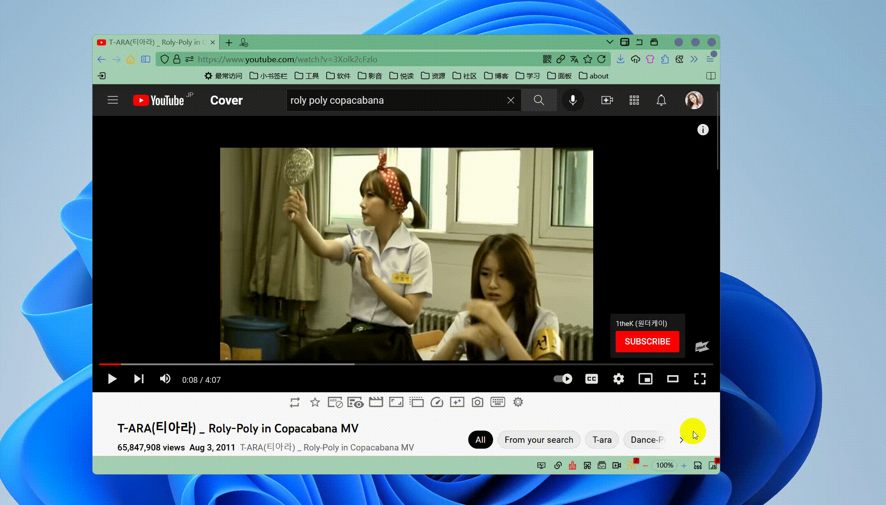

# VideoBtn 视频下载

之前就发过《[Firefox 添加“鼠标中键点击下载按钮条用 you-get.exe 下载视频” 的功能 - Ryan 快快跑](https://kkp.disk.st/firefox-adds-the-function-of-middle-click-the-download-button-bar-and-download-video-with-yougetexe.html)》，有人跟我说`you-get.exe`不太够用，下载国外视频网站就像被限速了一样，最近我这边下载确实也这样了，所以我花了两个晚上，重新弄了一个下载视频的脚本`VideoBtn.uc.js`。

## 使用说明

需要 userChromeJS script 环境，参考《[2202年了还在使用 userChrome JS 脚本之 Firefox userChrome JS 环境安装 - Ryan 快快跑](https://kkp.disk.st/in-2202-it-is-still-installed-in-firefox-userchromejs-environment-using-userchromejs-script.html)》

点击【[这里](VideoBtn.uc.js)】下载脚本，或者点击【[这里](VideoBtn.zip)】下载打包好的（打包好的我不一定记得更新）。

解压到 【配置文件夹\chrome】 下即可

如果需要修改路径，请修改相关的高级首选项(about:config)

`userChromeJS.VideoBtn.binPath`:视频下载工具存放路径，不填写自动读取`profieDir\chrome\resources\tools`

`userChromeJS.VideoBtn.savePath`:视频保存路径，不填写自动读取当前Windows账户的下载文件夹

`userChromeJS.VideoBtn.cookiesPath` Netscape 格式 Cookies 保存路径，不填写自动读取`profieDir\chrome\resources\cookies`

### 增加下载工具

目前没有外置配置数据，只能修改脚本。

把新增的 exe 放在视频下载工具存放路径下，然后修改脚本`MEMU_CONFIG`对象，可以参照内容添加一项菜单

```
{
    label: "you-get", // 菜单标题 
    tool: '\\you-get.exe', // 可执行文件名 \\ 表示相对路径，相对于工具文件夹，可以填写绝对路径
    condition: 'normal link', // 显示在右键菜单时的显示条件 normal 就是正常右键，link 就是在链接上
    text: '-o %SAVE_PATH% -c %COOKIES_PATH% %LINK_OR_URL%', // exe 调用参数
    image: 'data:image/svg+xml;base64,PHN2ZyB4bWxucz0iaHR0cDovL3d3dy53My5vcmcvMjAwMC9zdmciIHZpZXdCb3g9IjAgMCAyNCAyNCIgd2lkdGg9IjE2IiBoZWlnaHQ9IjE2IiBmaWxsPSJncmVlbiI+PHBhdGggZmlsbD0ibm9uZSIgZD0iTTAgMGgyNHYyNEgweiIvPjxwYXRoIGQ9Ik0xNyA5LjJsNS4yMTMtMy42NWEuNS41IDAgMCAxIC43ODcuNDF2MTIuMDhhLjUuNSAwIDAgMS0uNzg3LjQxTDE3IDE0LjhWMTlhMSAxIDAgMCAxLTEgMUgyYTEgMSAwIDAgMS0xLTFWNWExIDEgMCAwIDEgMS0xaDE0YTEgMSAwIDAgMSAxIDF2NC4yem0wIDMuMTU5bDQgMi44VjguODRsLTQgMi44di43MTh6TTMgNnYxMmgxMlY2SDN6bTIgMmgydjJINVY4eiIvPjwvc3ZnPg=='
}
```

text 自动替换参数说明 (参考的 addMenuPlus.uc.js，去除了用不到的参数并增加了必须的参数)

```
%T 当前网页标题
%TITLE% 当前网页标题
%TITLES% 当前网页简化标题
%U 当前网页 URL
%URL% 当前网页 URL
%H 当前网页域名
%HOST% 当前网页域名
%L 鼠标指向链接 （显示为右键菜单菜单时才有效）
%LINK% 鼠标指向链接 （显示为右键菜单菜单时才有效）
%RLT_OR_UT% 链接文本或网页标题
%LINK_OR_URL% 如果在链接上转换为链接 URL，如果不是则转换为当前网页 URL
%S 当前选中文本
%SEL% 当前选中文本
%SAVE_PATH% 保存路径
%COOKIES_PATH% 当前域名的 Netscape 格式 cookies 的保存路径
```

condition 参数说明（参考的 addMenuPlus.uc.js）

```
select 选中文本右键
link 链接右键
mailto 电子邮件右键
image 图片右键
media 多媒体（图片，音乐，视频）右键
input 输入框右键
normal 网页右键
```

### 效果演示




