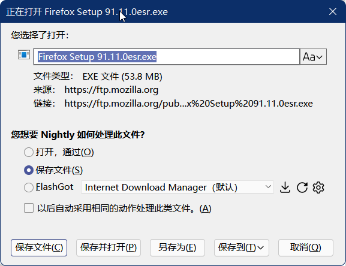

# downloadPlus_ff98.uc.js

Firefox下载增强工具

### 功能(Description)

- 默认选择下载文件
- 改名后保存
- 保存并打开
- 另存为
- 下载提示音
- 来源显示完整目录并支持双击复制完整地址
- 第三方工具下载（依赖 FlashGot）

### 说明(Usage)

高级首选项（about:config）

>`userChromeJS.downloadPlus.flashgotPath`: FlashGot.exe 路径
>
>`userChromeJS.downloadPlus.flashgotDefaultManager`: 默认下载器（默认情况下不需要修改，下载弹窗可以设置）
>
>`userChromeJS.downloadPlus.flashgotManagers`下载器列表（默认情况下不需要修改，下载弹窗可以一键读取）

FlashGot.exe 支持调用哪些下载工具详见：[pouriap/Firefox-DownloadGrab: A Firefox addon that lets you download links with external download manager](https://github.com/pouriap/Firefox-DownloadGrab)

### 本地化(Localization)

修改脚本，大概30行开始

```
const LANG = {
```

### 截图(Sceenshot)

#### downloadPlus_ff98.uc.js



### 感谢(Thanks)

[pouriap/Firefox-DownloadGrab: A Firefox addon that lets you download links with external download manager](https://github.com/pouriap/Firefox-DownloadGrab)